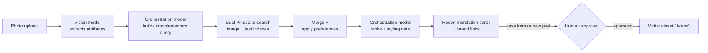

# Kiran's Digital Closet (Style Aggregator)

A personalized AI stylist that takes a photo of one item you already own -- a top, a bottom, or an accessory -- and recommends real, purchasable pieces that complete the outfit around it, pulled from across seven partner apparel brands in one place.

Upload a top, get matching bottoms and accessories. Upload a bottom, get matching tops and accessories. The recommendation always points toward what's missing from the outfit, never toward more of the same garment. This is retrieval-based, not image generation, and it is deliberately not a similarity search.

Built as the Week 3 "Build Your AI Agent" submission for The Gen Academy certification track.

## Agent Pattern

Single-agent pipeline -- one LangGraph state machine, not multiple peer agents and not a free-form ReAct loop:



Every arrow is a real runtime decision, not a fixed handoff. The graph branches on vision confidence and on thin search results, retries a failed tool call once, and stops for explicit human approval before any write.

## Stack

| Layer | Choice |
| --- | --- |
| Vision (image understanding) | GLM-5.3-Flash -- Fireworks primary, Nebius fallback |
| Orchestration (query building, ranking, styling) | Llama-3.3-70B via Nebius |
| Text embedding | Qwen3-Embedding-8B (Fireworks), output to 1024-dim |
| Image embedding | CLIP `clip-ViT-B-32`, local via `sentence-transformers` |
| Vector store | Pinecone -- two indexes: `bge-m3-index` (text), `clip-index` (image), 33,592 apparel products across 7 brands |
| Agent control flow | LangGraph (state, branching, retries, interrupts) |
| Preference memory | Mem0 (hosted Platform) |
| UI | Streamlit -- Upload & Recommend, My Closet, Preferences |
| Closet persistence | Flat JSON per user under `agent/data/closets/` |

## Tools

| Tool | Type | Notes |
| --- | --- | --- |
| `search_brand_inventory` | read | Dual Pinecone query, category-filtered |
| `get_user_preferences` | read | Mem0 |
| `remember_user_preference` | write | Mem0, gated behind human approval |
| `save_to_digital_closet` | write | Flat JSON per user, gated behind human approval |

## Repo Layout

Real, live code lives under `agent/`:

```text
agent/
  state.py         # LangGraph state schema
  tools.py         # all 6 tool implementations
  graph.py         # graph wiring, conditional edges
  demo.py          # 8 end-to-end scenarios
  streamlit_app.py # 3-page UI
  data/closets/   # per-user saved closet JSON
```

> Top-level `tools.py` / `graph.py` / `demo.py` in this repo are stale early snapshots -- the versions under `agent/` are the live ones.

Other important project areas:

| Path | Purpose |
| --- | --- |
| `agent/test_images/` | Demo images used by scripted scenarios |
| `agent/README.md` | Older agent-layer notes and implementation context |
| `embed_pipeline/` | Embedding and Pinecone upsert utilities |
| `Validate_Domains/` | Shopify domain validation and seed-data scripts |
| `docs/` | Project ledger and implementation notes |

Large seed/catalog JSON files live at the repository root because they are part of the project data trail.

## Running It

Run the Streamlit UI:

```bash
.venv/bin/python -m streamlit run agent/streamlit_app.py
```

Always use `.venv/bin/python` explicitly -- the system Python doesn't have `langgraph`, `streamlit`, `pinecone`, or `mem0ai` installed.

Run the scenario suite:

```bash
.venv/bin/python agent/demo.py
```

## Environment

The live agent expects API keys for the services it calls:

```bash
FIREWORKS_API_KEY=...
NEBIUS_API_KEY=...
PINECONE_API_KEY=...
MEM0_API_KEY=...
```

Local generated runtime data is ignored by Git:

```text
agent/uploads/
agent/data/closets/
```

## What Happens When Something Breaks

- Vision confidence too low -> ask the user to re-upload rather than proceed.
- Vision provider hard failure -> retry once against the fallback provider before surfacing an error.
- Too few search matches -> broaden the query once, then tell the user rather than fail silently.
- Any tool error (timeout, dead link) -> retry once, then a plain-language message.
- Any write (`save_to_digital_closet`, `remember_user_preference`) -> pauses for explicit human approval first, always.

## Dataset

34,168 raw products scraped from 7 brands' public Shopify `/products.json` endpoints, cleaned and audited down to 33,592 apparel-only products, embedded into two non-interchangeable vector spaces (text + image).

## Human-In-The-Loop Writes

Both write tools are deliberately gated:

- Saving a recommendation calls `save_to_digital_closet` only after the user approves it.
- Remembering a preference calls `remember_user_preference` only after the user approves it.

This keeps the agent autonomous for read/search/ranking work while making state-changing actions explicit and reviewable.

## Week 3 Deliverables

- Code: this repo, branch `step7-closet-persistence-and-ui`
- Project documentation: [link to your Google Doc]
- Video demo: [link once recorded]
