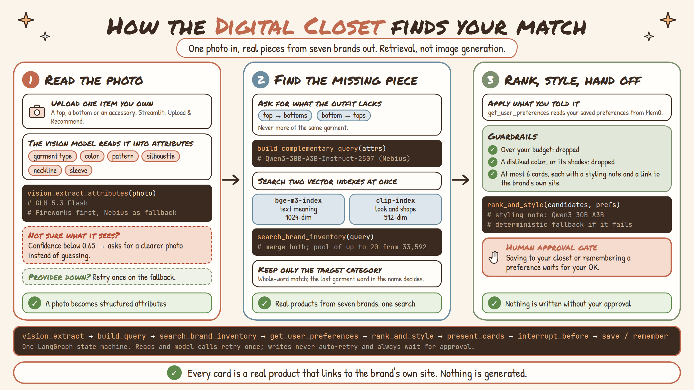
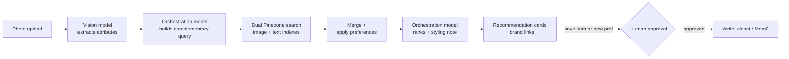
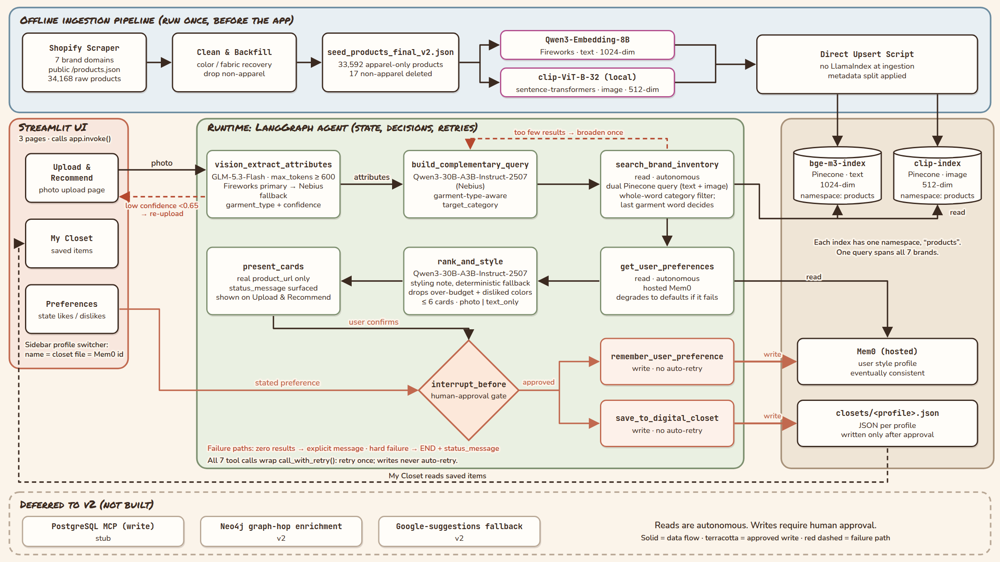

# Kiran's Digital Closet (Style Aggregator)

A personalized AI stylist that takes a photo of one item you already own -- a top or a bottom -- and recommends real, purchasable pieces that complete the outfit around it, pulled from across seven partner apparel brands in one place.

Upload a top, get matching bottoms. Upload a bottom, get matching tops. The recommendation always points toward what is missing from the outfit, never toward more of the same garment. This is retrieval-based, not image generation, and it is deliberately not a similarity search.

Built as the Week 3 "Build Your AI Agent" submission for The Gen Academy certification track.

## How It Works at a Glance



## Agent Pattern

Single-agent pipeline -- one LangGraph state machine, not multiple peer agents and not a free-form ReAct loop:



Every arrow is a real runtime decision, not a fixed handoff. The graph branches on vision confidence and on thin search results, retries a failed tool call once, and stops for explicit human approval before any write.

## Architecture



## Stack

| Layer | Choice |
| --- | --- |
| Vision (image understanding) | GLM-5.3-Flash -- Fireworks primary, Nebius fallback |
| Orchestration (query building, styling note) | Qwen3-30B-A3B-Instruct-2507 via Nebius (replaced Llama-3.3-70B, which Nebius deprecated from serverless on Aug 31, 2026) |
| Text embedding | Qwen3-Embedding-8B (Fireworks), output to 1024-dim |
| Image embedding | CLIP `clip-ViT-B-32`, local via `sentence-transformers` |
| Vector store | Pinecone -- two indexes: `bge-m3-index` (text) and `clip-index` (image), one namespace (`products`) each, covering all 7 brands |
| Agent control flow | LangGraph (state, branching, retries, interrupts) |
| Preference memory | Mem0 (hosted Platform), keyed by profile name |
| UI | Streamlit -- Upload & Recommend, My Closet, Preferences, with a profile switcher and a Soft Autumn theme |
| Closet persistence | Flat JSON per profile under `agent/data/closets/` |

## Tools and LLM Steps

| Tool | Type | Notes |
| --- | --- | --- |
| `search_brand_inventory` | read | Dual Pinecone query (text + image), merged, then category-filtered by whole-word match where the last garment word in the product name decides |
| `get_user_preferences` | read | Mem0: disliked colors, preferred brands, budget |
| `remember_user_preference` | write | Mem0, gated behind human approval |
| `save_to_digital_closet` | write | Per-profile JSON file, gated behind human approval |

| LLM step | Model |
| --- | --- |
| `vision_extract_attributes` | GLM-5.3-Flash (Fireworks, Nebius fallback) |
| `build_complementary_query` | Qwen3-30B-A3B-Instruct-2507 (Nebius) |
| `rank_and_style` | Qwen3-30B-A3B-Instruct-2507 (Nebius) for the styling note, with a deterministic fallback |

## How Recommendations Are Chosen

1. The vision model reads the photo into structured attributes (garment type, color, pattern, silhouette, neckline, sleeve type).
2. The orchestration model turns those attributes into a query for the complementary item (a top gets bottoms, a bottom gets tops).
3. Search returns a pool of up to 20 candidates, which are filtered to the target category.
4. `rank_and_style` drops candidates over the profile's budget and candidates whose product name contains a disliked color (whole-word match; disliking a color family such as "green" also excludes its shades -- olive, sage, emerald, seafoam, and so on).
5. At most 6 cards are shown, with a short styling note and a link to each product on the brand's own site.

## Profiles and Memory

The sidebar has a profile switcher ("+ New profile..." plus a Create profile button). The profile name is the closet filename and the Mem0 user id, so the three always match. State lives in three places:

- Per-profile closet JSON (`agent/data/closets/<profile>.json`), written only after the user approves a save.
- Hosted Mem0 preferences (disliked colors, preferred brands, budget) for the same profile, also written only after approval.
- LangGraph thread state for the current run.

## Repo Layout

Live code is under `agent/`:

```text
agent/
  state.py           # LangGraph state schema
  tools.py           # tool implementations and LLM calls
  graph.py           # graph wiring, conditional edges, interrupts
  demo.py            # 8 end-to-end scenarios
  streamlit_app.py   # 3-page UI
  .streamlit/        # Streamlit theme (config.toml)
  test_images/       # photos used by the demo scenarios
  data/closets/      # per-profile saved closet JSON (git-ignored)
```

| Path | Purpose |
| --- | --- |
| `agent/README.md` | Short notes for the agent layer |
| `embed_pipeline/` | Embedding and Pinecone upsert utilities |
| `Validate_Domains/` | Shopify domain validation, scraper and attribute-backfill scripts |
| `docs/` | Project ledger and implementation notes |

Large seed and catalog JSON files live at the repository root because they are part of the project data trail.

## Setup

The agent and UI need Python 3.10.9 or newer (developed on Python 3.14) and these packages:

```bash
python -m venv .venv
source .venv/bin/activate
pip install langgraph mem0ai pinecone sentence-transformers streamlit requests pillow
```

`pyproject.toml` currently lists only `mem0ai` and `requests`, so install the packages above yourself. Versions used in development: streamlit 1.63.0, langgraph 1.2.11, pinecone 10.0.0, mem0ai 2.0.20, sentence-transformers 6.0.1.

The app calls live services (Fireworks, Nebius, Pinecone, Mem0), so it needs these environment variables:

```bash
FIREWORKS_API_KEY=...
NEBIUS_API_KEY=...
PINECONE_API_KEY=...
MEM0_API_KEY=...
```

The code reads them with `os.environ` and does not load a `.env` file itself. Keep them in a git-ignored `.env` at the repo root and load them into your shell first (for plain KEY=value lines: `set -a; source .env; set +a`). The Pinecone indexes and the Mem0 project are the author's hosted resources, so a full run needs access to those.

## Running It

Run both commands from inside `agent/`. Streamlit reads the theme from `agent/.streamlit/config.toml` relative to the directory it is launched from, and the demo uses relative paths to `test_images/`.

```bash
cd agent
streamlit run streamlit_app.py --server.port=8501
```

```bash
cd agent
python demo.py
```

Scenario 8 writes a real preference to Mem0 for the user id `kiran-demo-user`.

## Demo Scenarios

`agent/demo.py` runs eight scenarios end to end:

1. Happy path: a top photo, confident tag, recommendations, approved save.
2. Bottoms photo: garment type read as "bottom", so the target category is tops.
3. Low-confidence photo: the agent asks for a clearer re-upload instead of searching.
4. Search fails once: the retry succeeds.
5. Zero search results: an explicit "no strong pairing" message, not a blank view.
6. Vision fails on both attempts: graceful stop, no crash.
7. Query building fails on both attempts: graceful stop, no crash.
8. State a dislike, approve remembering it, and see it reflected in a later, independent run.

## What Happens When Something Breaks

- Vision confidence too low -> ask the user to re-upload rather than proceed.
- Vision provider hard failure -> retry once against the fallback provider before surfacing an error.
- Too few search matches -> broaden the query once, then tell the user rather than fail silently.
- Any read-tool error (timeout, dead link) -> retry once, then a plain-language message. The two write tools never auto-retry, to avoid a double write.
- Any write (`save_to_digital_closet`, `remember_user_preference`) -> pauses for explicit human approval first, always.

## Dataset

34,168 raw products scraped from 7 brands' public Shopify `/products.json` endpoints, cleaned and audited down to 33,592 apparel-only products, embedded into two non-interchangeable vector spaces (text + image).

## Human-In-The-Loop Writes

Both write tools are deliberately gated:

- Saving a recommendation calls `save_to_digital_closet` only after the user approves it.
- Remembering a preference calls `remember_user_preference` only after the user approves it.

This keeps the agent autonomous for read, search and ranking work while making state-changing actions explicit and reviewable.

## Known Limitations

- Disliked colors are matched against product names only (Pinecone has no color field), so a product whose name has no color word can slip through.
- If every candidate in the pool matches a disliked color, the filter falls back to the unfiltered list rather than showing nothing, so a small pool can still show a disliked color.
- Switching profiles leaves the previous profile's Upload & Recommend results on screen until the next upload.
- Saved preferences cannot be removed or edited in the app; they are managed in Mem0.
- Preference parsing from Mem0 text is keyword-based, so a sentence like "doesn't like green but loves navy" would also flag navy.
- Mem0 writes are eventually consistent: a just-saved preference can take a few seconds to be readable.

## Week 3 Deliverables

- Code: this repository, branch `fix/category-head-noun-match`
- Project documentation: [Week 3 Project Documentation](https://docs.google.com/document/d/1h8AQDW1LYn3ZS9TOXAwQaAfpmj_2fC7n/edit) and [The Agent Framework, field by field](https://docs.google.com/document/d/150cDnKnnn7Q65aac-agYiBFAiERxU6YL/edit)
- Video demo: [Demo video](https://drive.google.com/file/d/1bgQAkA-FX0KD2kcd72I6P2VHfEfrSkJP/view?usp=drive_link)
